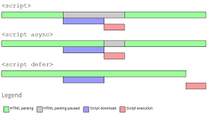

# async와 defer의 차이점

## 1. Head + script

Script가 head에 존재할 때 js를 fetching하고 executing하는 동안 blocking되기 때문에 만약 js file의 크기가 크다면 시간이 걸리게 된다. 그리고 body의 마지막에 script가 존재할 때 Parsing HTML이 끝나고 page가 준비된 다음 js가 fetching되면 user가 page를 먼저 받을 수 있어 문제가 없어보일 수 있지만 만약 js dependent한 page라면 이 또한 user가 불완전한 page를 받게 되기 때문에 문제가 된다.

-DOM을 따라 반드시 순서대로 실행되어야 할 때 사용 BUT page가 나타나는데 시간이 많이 걸릴 수 있다.

## 2. Head + script async

Parsing HTML을 하는 동안 fetching을 병렬적으로 받을 수 있어서 시간이 절약되긴 하나 js가 html이 parsing되기도 전에 fetching되면 만약 queryselector를 통해 DOM 요소를 조작하는 경우 html 내 정의되어 있지 않다면 문제가 될 수 있다.

-DOM이나 다른 script dependency가 없고, 실행 순서가 중요하지 않은 경우 사용 BUT script에 비해 시간은 단축되긴 하나 순서가 중요한 경우 문제가 발생할 수 있다.

## 3. Head + script defer

defer는 parsing HTML과 fetching js를 병렬적으로 하면서도 executing js는 html을 parsing한 후 page가 준비되었을 때 실행되기 때문에 DOM이나 다른 script dependency가 있어도 실행 순서에 맞게 실행시킬 수 있기 때문에 좋다.

-DOM이나 다른 script dependency가 있고, 실행 순서가 중요한 경우 사용 > 제일 효율적이고 안전하다.

