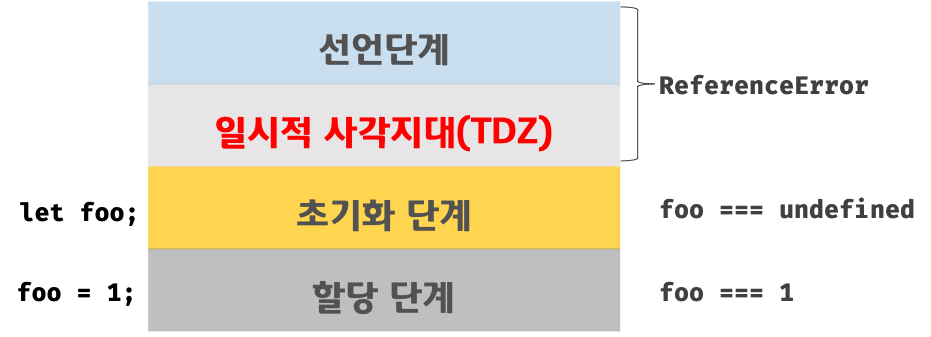

# Scope

모든 식별자(변수 이름, 함수 이름, 클래스 이름)는 자신이 선언된 위치에 의해 다른 코드가 식별자 자신을 참조할 수 있는 유효 범위가 결정되는 것을 말한다.
이는 자바스크립트 엔진이 식별자의 유효 범위를 검색할 때 사용하는 규칙으로 볼 수 있다.
<br/>
scope chain에 의하면 상위 스코프에서 유효한 변수는 하위 스코프에서 자유룝게 참조할 수 있지만 하위 스코프에서 유효한 변수를 상위 스코프에서 참조할 수 없다.
<br/>

> 최상위 스코프인 전역 스코프
> <br/>

> 전역에서 선언된 outer 함수의 지역 스코프
> <br/>

> outer 함수 내부에서 선언된 inner 함수의 지역 스코프
> <br/>

자바스크립트는 lexical scope로 함수를 어디서 호출했는지가 아닌 어디서 정의했는지에 따라 함수의 상위 스코프를 결정한다.

```javascript
var x = 1;

function foo() {
  var x = 10;
  bar();
}

function bar() {
  console.log(x);
}

foo();
bar();
```

위 예제에서 bar 함수는 전역에서 정의된 함수이다. 이는 foo 함수에 호출되는 형태이긴 하지만 자바스크립트는 렉시컬 스코프를 따르므로 전역 스코프를 상위 스코프로 사용한다. 따라서 1을 두번 출력한다.

<br/>

# 전역 변수의 문제점

변수의 생명 주기는 메모리 공간이 확보된 시점부터 메모리 공간이 해제되어 가용 메모리 풀에 반환되는 시점까지이다. 따라서 지역 변수의 생명 주기는 함수의 생명 주기와 일치한다고 볼 수있다.
<br/>
반면 전역 변수는 선언한 의도가 코드 어디서든 참조하고 할당할 수 있는 변수를 사용하겠다는 것이다. (implicit coupling) 하지만 변수는 유효 범위가 크면 클수록 코드의 가독성은 나빠지고 의도치 않게 상태가 변경될 수 있는 위험성도 높아진다. 그래서 전역 변수의 무분별한 사용은 위험하다. 전역 변수를 반드시 사용해야 할 이유를 찾지 못한다면 지역 변수를 사용해야 한다. 이를 위하여 IIFE( Immediately Invoked Function Expression)의 지역 변수로 코드를 감싸면 전역 변수의 사용을 제한할 수 있다.

<br/>

# let, const keyword and block-level scope

ES5까지 변수 선언에서 사용된 var 키워드로 선언한 변수는 오로지 함수의 코드 블록만을 지역 스코프로 인정한다. 이는 런타임 이전에 자바스크립트 엔진에 의해 암묵적으로 "선언 단계"와 "초기화 단계"가 한번에 진행되어 variable hoisting이 발생한다.
<br/>

> 선언 단계는 자바스크립트 엔진에 변수의 존재를 알리는 것이다.
> <br/>

> 초기화 단계는 undefined로 변수를 초기화하는 것이다.

따라서 선언문 이전에 변수에 접근해도 스코프에 변수가 존재하기 때문에 error가 발생하지 않는 것이다.

<br/>

하지만 let, const는 var과는 다르게 block-level scope이기 때문에 모든 코드 블록(함수, if문, for문, try/catch문) 을 지역 스코프로 인정한다. 또한 선언단계와 초기화 단계가 분리되어 진행되기 때문에 일시적 사각지대(TDZ)가 생겨 RefferenceError가 발생한다.

<br/>



이는 variable hoisting이 발생하지 않는 것처럼 보이지만 단지 let variable이 선언 단계만 거치고 초기화 단계를 거치기 전에 참조하였기 때문에 error가 발생한 것이다. 아래 예제를 통해 hoisting이 이루어짐을 알 수있다.

```javascript
let foo = 1; //전역 변수

{
  console.log(foo); //ReferenceError
  let foo = 2; //지역 변수
}
```

const는 상수로 let과 달리 재할당이 불가하고 반드시 선언과 동시에 초기화를 해야 한다.

```javascript
const foo = 1;
```
